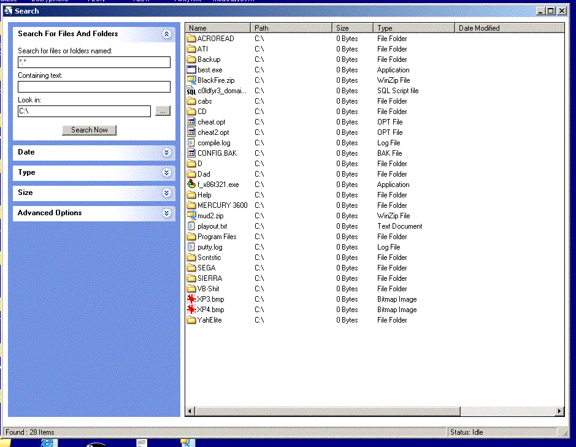



## XP Fast Search

### Description

This is a complete search program to rival that of windows.

It compares file names, dates, sizes, and types with the added ability of searching Zip folders !

A nice user interface with not too many added bells and whistles but still enough to make it worth a download at least.

I have lost all of the credits to the authors of some of the code I have used to create this, if you are one of those authors, please email me ASAP and I will add your name.

If you don't like this code, vote that way, if you do, vote that way either ! Just please, leave all your honest opinions and votes !

This code also shows alot of interesting methods of doing simple tasks with both your form, windows, and your programming abilities.

Examples such as how to put your form on top, Read and Write to the registry, enum registry keys, Sort arrays, Use ImageCombo, ListView's and ImageLists, Load Icons from files, compare file dates and sizes, Findfolder dialog with no ocx, Get Windows Special Folders, Read Zip file headers and much much more.

KeyWords : File, Folder, Search, Class, Common, Array, Visual, Style, XP, ListView, ImageCombo, ImageList. 

Updated 14/08/03 : It was showing an error when you used the explorer menu bar entry for "Start Searching Here", that is now fixed.
 
### More Info
 
Search File Spec

File List

Note: Sometimes the splash screen doesn't work, im unsure why as of yet.

             |
---                |---
**Submitted On**   |2003-08-14 03:48:20
**By**             |[c0ldfyr3](https://github.com/Planet-Source-Code/PSCIndex/blob/master/ByAuthor/c0ldfyr3.md)
**Level**          |Intermediate
**User Rating**    |4.5 (59 globes from 13 users)
**Compatibility**  |VB 6\.0
**Category**       |[Complete Applications](https://github.com/Planet-Source-Code/PSCIndex/blob/master/ByCategory/complete-applications__1-27.md)
**World**          |[Visual Basic](https://github.com/Planet-Source-Code/PSCIndex/blob/master/ByWorld/visual-basic.md)
**Archive File**   |[XP\_Fast\_Se1629738142003\.zip](https://github.com/Planet-Source-Code/c0ldfyr3-xp-fast-search__1-47680/archive/master.zip)

